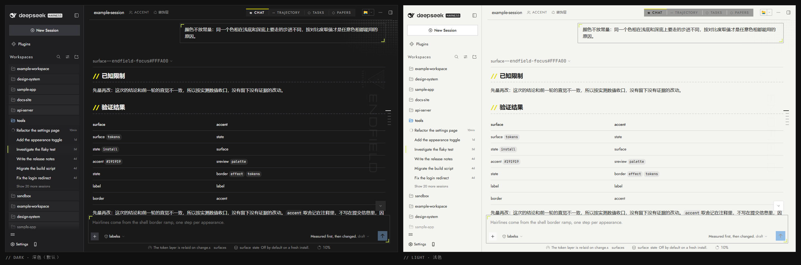

# DSH Skin: Endfield

以《明日方舟：终末地》(Arknights: Endfield) 平面设计语言为主题的 **DSH Web GUI 皮肤插件**：
深色工业画布 `#191919` + 信号黄 `#FFFA00`，直角面板、发丝线、角括号、`//` 区块前缀、45° 斜线、黄绿焦点描边。

皮肤是**纯加法**：不替换外壳组件、不引用任何 hashed 类名、不 provide 任何 Cordis 服务。卸载后完全还原。

## 效果图

左深色（默认）、右浅色，取自运行中的应用：



图上**文字是脚本生成的示例文本**，不是任何真实会话的内容；布局、配色与控件位置都是外壳真实渲染的结果。
重新生成：`pnpm shots:readme`（需要 `dsh web` 在跑）。

## 安装

```sh
pnpm install
pnpm build
dsh plugin --profile web add <本仓库路径>
dsh plugin --profile web install
# 重启 dsh web，刷新页面
```

> ⚠️ 会写 `~/.dsh/profiles/web/package.json`，操作前先备份。
> 卸载：`dsh plugin --profile web remove dsh-skin-endfield` 后重启。

## 设置

在 **设置 → Endfield Skin**，共 15 项；改值立即生效。

| 项 | 作用 | 默认 |
|----|------|------|
| **Accent** | 品牌/状态族颜色：发送按钮、激活工作区的模块图标、徽章、链接、输入光标 | 薄荷绿 `#00FFA2` |
| **Focus outline** | 选中/焦点描边色与其泛光 | 黄绿 `#D0E94F` |
| **Panel fill** | 输入框卡片与消息气泡是否保留填充面板 | 关（扁平） |
| **Bloom** | 描边外发光强度 | `0.28` |
| **Corner radius** | `0` 直角；正数把压平的表面圆回来 | `0` |
| **Section marker** | 是否显示 `//` 前缀标记 | 开 |
| **Top-bar light** | 顶栏内的环境光 | 关 |
| **Page mark** | 正文面板上的印版图 | 关 |
| **Artwork** | 印版：完整锁定 / 字标 / 图章 / 两者合成 | 完整锁定 |
| **Custom image** | 上传本地图（PNG/JPEG/WebP/GIF，≤ 2 MB）取代印版 | 无 |
| **Orientation** | 横排 / 竖排 | 横排 |
| **Position** | 印版贴面板哪个角 | 右上 |
| **Size** | 图片长边倍率 | `1` |
| **Opacity** | 图片浓淡 | `0.12` |
| **Dot block** | 正文右上角的点阵网纹 | 关 |

## 常用命令

```sh
pnpm build          # 构建插件（lib/index.js + lib/client.js）
pnpm watch          # 改源码保存即生效，免重启
pnpm typecheck
pnpm verify         # 全套检查：离线 + 运行中 GUI 实测
pnpm shots:readme   # 重新生成上面的效果图
pnpm showcase       # 令牌对照板（示意渲染，非实机截图）
```

改完源码要重启一次 `dsh web` 才生效的部分：路由与设置项本身。样式与配色改动 `pnpm build` 后刷新页面即可。

## 已知限制

- **浅色为派生色**，尚未逐屏复核对比度。
- 发送按钮的字色按对比度自动取黑或白，所以默认薄荷按钮上是**黑箭头**。
- **Corner radius 只能把所有表面统一成同一半径**，不会还原外壳原本各不相同的圆角。
- 印版与字体由插件在 `dsh web` 启动时提供：安装或更新后**要重启一次**才能看到。
- 顶栏标题的截断长度由外壳决定，皮肤加的 `///` 前缀会额外占用其中约 33px。

## 授权

MIT。内置字体为 OFL（Jost / Michroma / JetBrains Mono），作为商业字体的角色替代；默认页标由本机素材合成，源图未入库；设计参考集不入库。

## 更多

- [docs/engineering-notes.md](docs/engineering-notes.md) —— 详细工程记录：每条规则为什么这么写、实测数据、试过又回退的版本。
- [docs/design-reference/](docs/design-reference/) —— 设计资料研究笔记。
- [assets/manifest.md](assets/manifest.md) —— 参考集清单与重新抓取方式。
